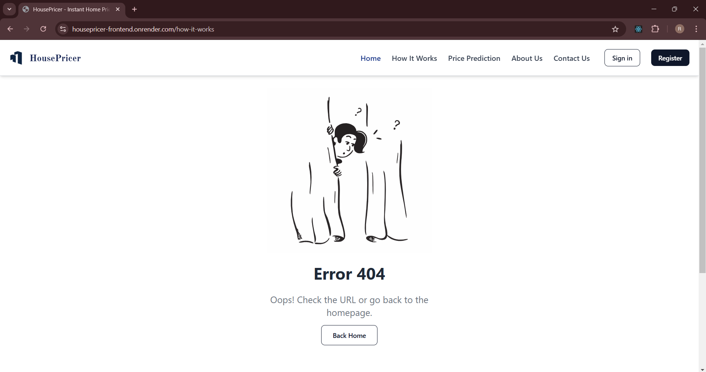

# House Price Prediction

## Project Overview
This project is a **data science-driven web application** designed to predict house prices based on various features such as location, size, number of bedrooms, and other factors. The main objective is to build a tool that allows users to input relevant house details and receive an estimated market price based on historical data and machine learning models.

We are using the **MERN stack** for the frontend and backend integration, while the machine learning model is built using **Python** and served via an API. This project provides us with an opportunity to practice both web development and data science concepts, focusing on creating a full-stack application that is both functional and scalable.

##

### Some Previews

